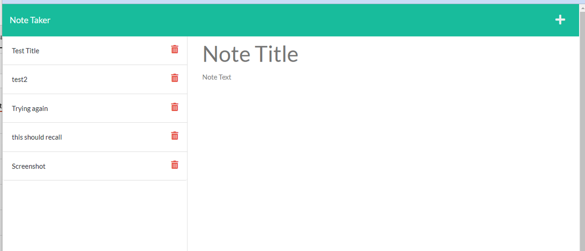

# Notes Application

## Overview
This challenge assignment was to create an application to create, store, and serve notes created by a user.

## Description
The Acceptance Criteria is as follows:

GIVEN a note-taking application
WHEN I open the Note Taker
THEN I am presented with a landing page with a link to a notes page
WHEN I click on the link to the notes page
THEN I am presented with a page with existing notes listed in the left-hand column, plus empty fields to enter a new note title and the note’s text in the right-hand column
WHEN I enter a new note title and the note’s text
THEN a Save icon appears in the navigation at the top of the page
WHEN I click on the Save icon
THEN the new note I have entered is saved and appears in the left-hand column with the other existing notes
WHEN I click on an existing note in the list in the left-hand column
THEN that note appears in the right-hand column
WHEN I click on the Write icon in the navigation at the top of the page
THEN I am presented with empty fields to enter a new note title and the note’s text in the right-hand column

## Table of Contents

1. [Installation](#installation)
2. [Usage](#usage)
3. [Licenses](#licenses)
4. [Contributing](#contributing)
5. [Tests](#tests)
6. [Questions](#questions)

## Installation
A link to the deployed site can be found [here](https://notes-app-ks1.herokuapp.com/). This project requires Express.js. Please review and install all required dependencies. A screenshot of the site is shown below: 

## Usage
To use this application, click the Get Started button to be taken to the notes library. To add a note, click Note Title to type the title and tab or click Note Text to add the body of the note. Once you add the body of the note, you can access the save button to add it to the log of notes. Notes in the note log can be deleted by clicking the trash can on the note item. 

## Licenses
This project uses the MIT license. More info about licenses can be found [here](https://choosealicense.com/).

## Contributing
This project is open for contribution but please initiate an issue for any significant changes. 

## Tests
There are no tests for this application.

## Questions
The developer can be reached through [email](mikeandkris27@gmail.com) or contacted through [Github](https://github.com/kristensantee) or [LinkedIn](https://linkedin.com/in/kristen-santee).
